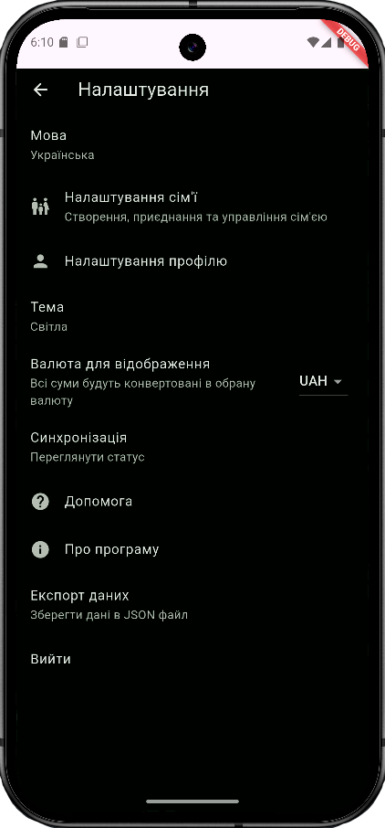
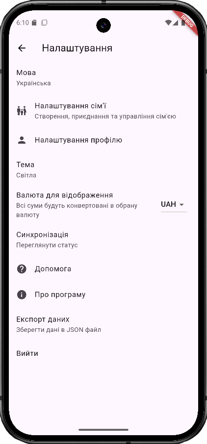
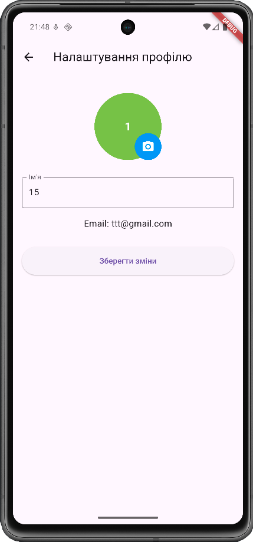
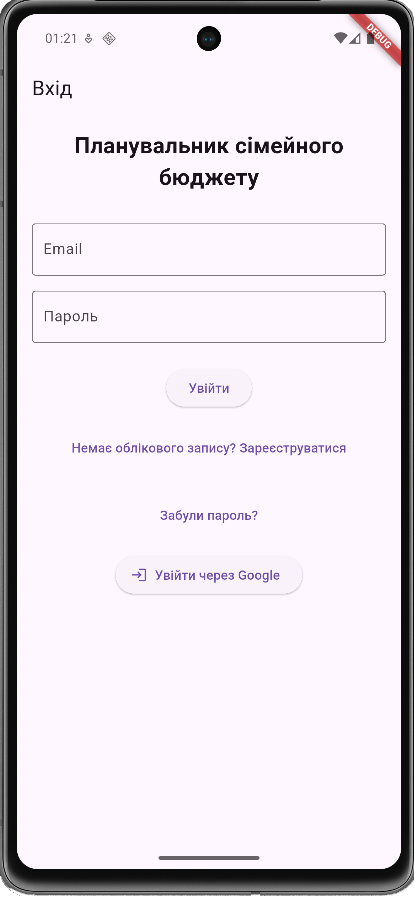
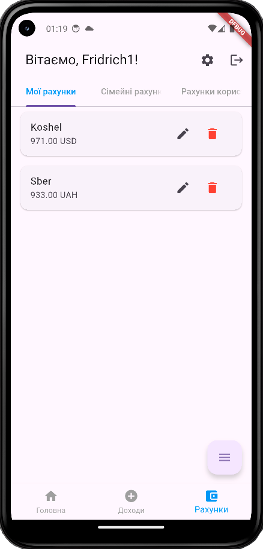
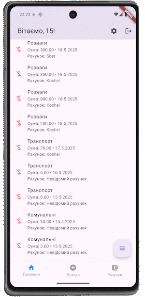
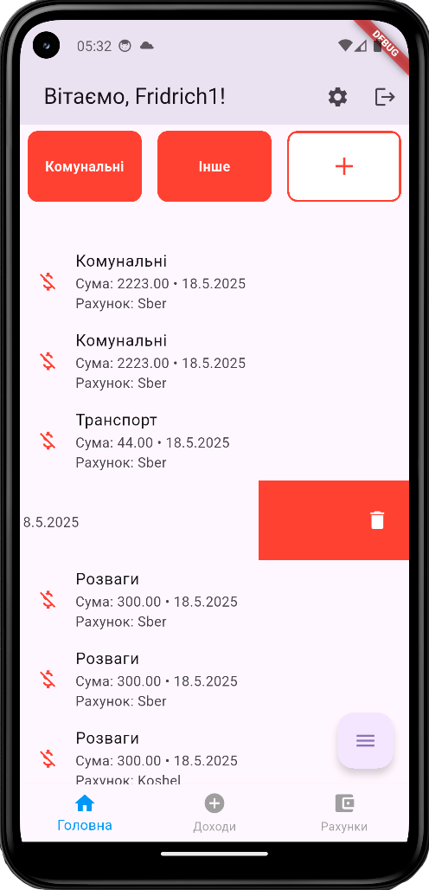

# Family Budget Planner

**Семейный финансовый менеджер** — мобильное приложение для учёта расходов и доходов семьи.

[](https://flutter.dev)
[](https://firebase.google.com)

---

## Особенности
- Синхронизация данных в реальном времени (Firebase)
- Роли: взрослый / ребёнок
- Общие и личные счета
- Категории с перетаскиванием
- Статистика и графики
- Геотеги транзакций (Google Maps)
- Режим редактирования
- AI-помощник (в разработке)

---

## Скриншоты

<div align="center">
  <h3>Прокрути вправо ←→</h3>
</div>

<div align="center">
  <div style="overflow-x: auto; white-space: nowrap; display: flex; gap: 10px; padding: 10px; max-width: 100%; scrollbar-width: thin;">
    
    
    
    
    
    
    
    
    
    
    
    
    
    
    
    
    
    
    
    
  </div>
</div>

---

## Как запустить

```bash
git clone https://github.com/YuriyAntropov/family-budget-planner.git
cd family-budget-planner
flutter pub get

Добавь google-services.json в android/app/ (из Firebase Console)
Включи Authentication и Firestore
Запусти: flutter run


API-ключи удалены из репозитория для безопасности


Технологии

Flutter — UI
Firebase — Auth + Firestore
Provider — состояние
Google Maps — геолокация
ReorderableGridView — перетаскивание


Безопасность

API-ключи удалены из истории Git
Используется .gitignore
Проект безопасен для портфолио


Автор
Yuriy Antropov
GitHub
Дипломная работа, 2025
