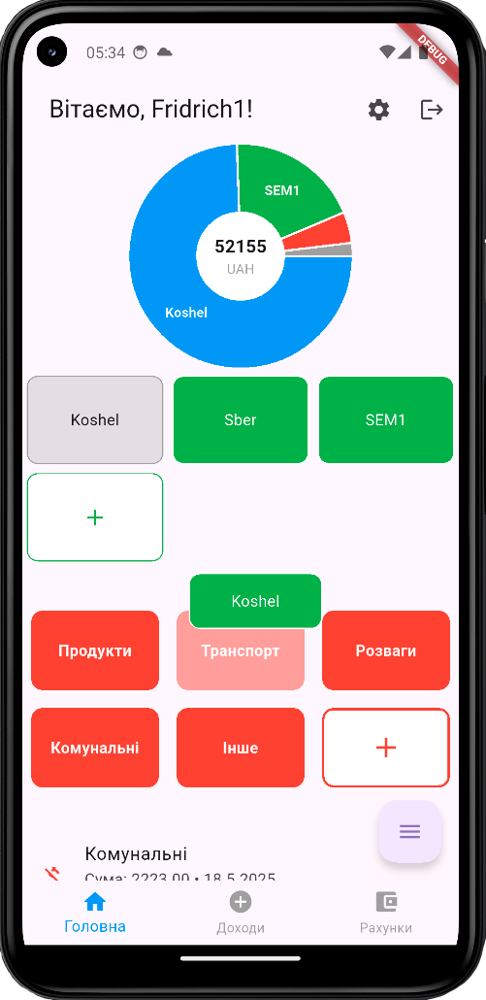
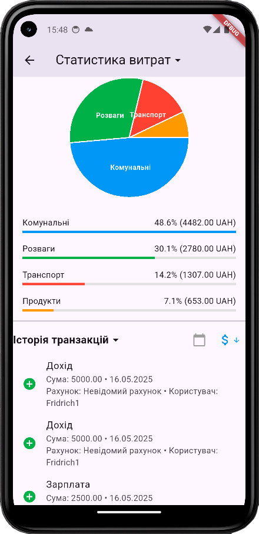

# Family Budget Planner

**Семейный финансовый менеджер** — мобильное приложение для ведения семейного бюджета.

## Особенности
- Синхронизация данных между членами семьи
- Учёт расходов и доходов
- Категории, счета, статистика
- Режим редактирования (удаление/перемещение)
- Поддержка детей (ограниченный доступ)
- Геотегирование транзакций
- AI-помощник и чат (в разработке)

## Скриншоты




## Технологии
- **Flutter** (Dart)
- **Firebase** (Auth, Firestore)
- **Provider** (управление состоянием)
- **Google Maps**
- **Shared Preferences**

## Установка
```bash
git clone https://github.com/YuriyAntropov/family-budget-planner.git
cd family-budget-planner
flutter pub get
flutter run